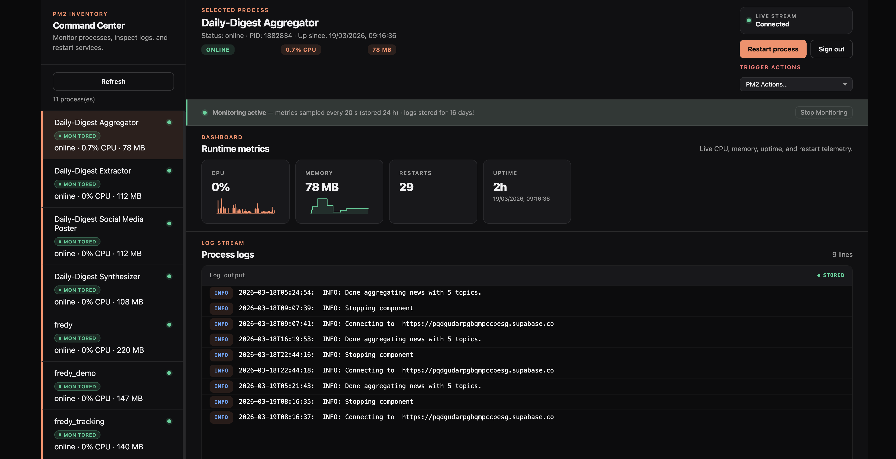

<p align="center">
  <h1 align="center">PM2 Manager</h1>
  <p align="center"><strong>A modern, real-time web dashboard for your PM2 processes.</strong></p>
  <p align="center">Monitor, restart, and tail logs - all from a sleek dark-mode UI.</p>
</p>

<p align="center">
  
  
  
  
  
</p>

---

## Features

- **Live process overview** - CPU, memory, uptime, and restart count at a glance
- **Real-time log streaming** - stdout & stderr tailed directly in the browser
- **Persistent monitoring** - CPU/memory history and logs stored in SQLite, survives page reloads
- **One-click restart** - restart any process with an inline confirmation
- **PM2 custom actions** - trigger any `axm_actions` your processes expose
- **Secure by default** - scrypt password hashing, CSRF protection, rate limiting, CSP headers
- **Single WebSocket connection** - no polling, no SSE; all real-time data over one multiplexed stream
- **Dark-mode UI** - clean, responsive dashboard that works on desktop and mobile

---

## Screenshots

| Login | Main View |
|---|---|
|  |  |

---

## 📡 Live vs. Monitored Processes

PM2 Manager has two modes for each process.

**Live only (default)**

When you open a process without enabling monitoring, you see real-time CPU, memory, and a live log stream. None of this is saved. Navigating away or closing the tab loses the history - when you return you start fresh.

**Monitored**

Click *Start Monitoring* on any process to enable persistent tracking. PM2 Manager will:

- Sample CPU and memory every 20 seconds and store the history (default: 24 hours)
- Persist incoming log lines to the database (default: 14 days)
- Show a sparkline chart of CPU and memory over time
- Backfill the last log entries from the PM2 log files on first enable

Monitoring state survives server restarts. You can stop monitoring at any time - this removes all stored history for that process.

---

## 🚀 Quick Start

### Prerequisites

- Node.js 22 or higher
- PM2 installed globally (`npm i -g pm2`)
- At least one PM2 process running

### 1. Clone & install

```bash
git clone https://github.com/orangecoding/pm2-manager.git
cd pm2-manager
yarn install
```

### 2. Configure

Copy the example env file and open it in your editor:

```bash
cp .env.example .env
```

Generate a password hash and paste the output into `.env`:

```bash
node -e "
  const crypto = require('crypto');
  const salt = crypto.randomBytes(16).toString('hex');
  const hash = crypto.scryptSync('YOUR_PASSWORD', Buffer.from(salt,'hex'), 64).toString('hex');
  console.log('AUTH_PASSWORD_SALT=' + salt);
  console.log('AUTH_PASSWORD_HASH=' + hash);
"
```

### 3. Build & run

```bash
npm start
```

Open **http://localhost:3030** in your browser.

### 4. Run as a PM2 process (recommended)

The recommended production setup is to run PM2 Manager as a PM2 process itself so it is supervised and auto-restarted:

```bash
npm run build
pm2 start lib/transport/server.js --name pm2-manager
pm2 save
```

---

## 🔄 Updating

`update.sh` handles the full update cycle for a self-hosted installation:

```bash
./update.sh
```

It will:

1. Pull the latest commits from upstream (fast-forward only - aborts if there are local changes)
2. Install or update Node.js dependencies
3. Rebuild the frontend bundle
4. Restart the `pm2-manager` process under PM2 (if running)

Make the script executable once before first use:

```bash
chmod +x update.sh
```

If PM2 Manager is not running under PM2 when the script finishes, it will print the commands to start it manually.

> [!NOTE]
> **Database location** — by default the database is written to `./data/pm2-manager.db` inside the project directory. If you update by replacing the project folder (e.g. re-cloning), this file will be lost. Point `SQLITE_DB_PATH` at a directory outside the project to keep your data safe across updates (`pm2-manager.db` is created inside it automatically):
> ```bash
> SQLITE_DB_PATH=/var/lib/pm2-manager
> ```
> Create the directory first: `mkdir -p /var/lib/pm2-manager`

> [!NOTE]
> **PM2 timestamps** — PM2 Manager merges stdout and stderr and sorts log lines chronologically. This requires PM2 to prefix each line with a timestamp. Always start your processes with `--time`:
> ```bash
> pm2 start app.js --name my-app --time
> ```
> Without it, log lines from stdout and stderr cannot be sorted correctly.

---

## ⚙️ Configuration

All settings are read from a `.env` file in the project root. Copy `.env.example` to get started.

**Server**

| Variable | Default | Description |
|---|---|---|
| `HOST` | `0.0.0.0` | Bind address |
| `PORT` | `3030` | HTTP and WebSocket port |

**Authentication**

| Variable | Default | Description |
|---|---|---|
| `AUTH_USERNAME` | `admin` | Login username (case-insensitive) |
| `AUTH_PASSWORD_SALT` | - | Hex-encoded salt (generated above) |
| `AUTH_PASSWORD_HASH` | - | Hex-encoded scrypt hash (64 bytes) |
| `SESSION_TTL_MS` | `28800000` | Session lifetime in ms (default: 8 h) |

**Rate limiting**

| Variable | Default | Description |
|---|---|---|
| `AUTH_MIN_RESPONSE_MS` | `900` | Minimum login response time (timing-attack mitigation) |
| `LOGIN_WINDOW_MS` | `600000` | Sliding window for login attempts (10 min) |
| `LOGIN_MAX_REQUESTS` | `12` | Max login attempts per window |
| `LOGIN_FAILURE_WINDOW_MS` | `1800000` | Window for exponential lockout (30 min) |
| `LOGIN_BASE_LOCKOUT_MS` | `30000` | Initial lockout after repeated failures (30 s) |
| `LOGIN_MAX_LOCKOUT_MS` | `43200000` | Maximum lockout period (12 h) |
| `UNAUTH_WINDOW_MS` | `60000` | Window for unauthenticated access attempts (1 min) |
| `UNAUTH_MAX_REQUESTS` | `10` | Max unauthenticated hits before a 5 s penalty |
| `UNAUTH_PENALTY_MS` | `5000` | Delay added to rate-limited unauthenticated responses |

**Cookies & proxy**

| Variable | Default | Description |
|---|---|---|
| `COOKIE_SECURE` | `auto` | `auto` / `always` / `never` |
| `TRUST_PROXY` | `0` | Set to `1` when behind a reverse proxy |

**Storage**

| Variable | Default | Description |
|---|---|---|
| `SQLITE_DB_PATH` | `./data` | Directory for the SQLite database (`pm2-manager.db` is created inside) |
| `METRICS_RETENTION_MS` | `86400000` | How long metric samples are kept (24 h) |
| `LOGS_RETENTION_MS` | `1209600000` | How long log entries are kept (14 days) |
| `MAX_LOG_BYTES_PER_FILE` | `5242880` | Max bytes read per PM2 log file (5 MB) |

---

## ⚡ Custom Actions with tx2

PM2 Manager can display and trigger custom actions that your app exposes to PM2 via **[tx2](https://github.com/pm2/tx2)**.

### Install tx2

```bash
npm install tx2
```

### Define actions in your app

```js
import tx2 from 'tx2';

// Simple action
tx2.action('clear cache', (done) => {
  myCache.flush();
  done({ success: true });
});

// Action with a parameter
tx2.action('set log level', (level, done) => {
  logger.setLevel(level);
  done({ level });
});
```

`done()` must always be called - it signals to PM2 that the action has completed and sends the return value back to the dashboard.

### Trigger from PM2 Manager

Once your process is running, open it in PM2 Manager. Any registered actions appear as buttons in the **Actions** panel.

**Available tx2 APIs**

| API | Purpose |
|---|---|
| `tx2.action(name, fn)` | Register a triggerable action |
| `tx2.action(name, { arity: 1 }, fn)` | Action that accepts a parameter |
| `tx2.metric(name, fn)` | Expose a live metric |
| `tx2.counter(name)` | Incrementing counter |
| `tx2.histogram(name)` | Value distribution histogram |

---

## Development

PM2 Manager uses a two-process dev setup: the Node.js backend runs on port 3030 and an esbuild dev server handles the frontend on port 3042 with instant rebuilds and hot module replacement.

### Start the backend

```bash
node --inspect lib/transport/server.js
```

### Start the frontend dev server

```bash
npm run dev
```

Open **http://localhost:3042**. The dev server proxies all `/api/*`, `/ws/*`, and HTML routes through to the backend.

### Tests, lint, format

```bash
npm test
npm run lint
npm run format        # write
npm run format:check  # check only
```

---

## Security

- **CSRF tokens** - one-time-use tokens rotated after every state-changing request
- **Rate limiting** - sliding window + exponential backoff on failed logins; separate rate limit for unauthenticated access
- **CSP headers** - strict Content-Security-Policy including `ws:`/`wss:` for WebSockets
- **Timing-attack mitigation** - constant-time credential comparison with a minimum response delay
- **Secure cookies** - `HttpOnly`, `SameSite=Strict`, optional `Secure` flag

---

## Sponsorship [](https://github.com/sponsors/orangecoding)

I maintain this and other open-source projects in my free time.
If you find it useful, consider supporting the project.

---

## License

[Apache-2.0](LICENSE) - © Christian Kellner
